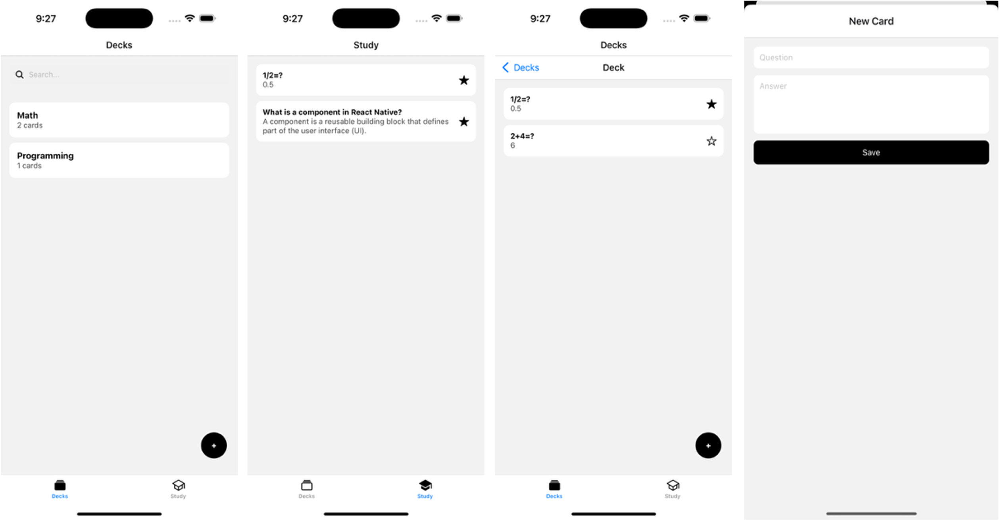

# Assignment 4: Flashcards Trainer

## Overview
In this assignment, you will build a **Flashcards Trainer mobile app** using **React Native** and **Expo Router**.  
The app helps users create, browse, and study decks of flashcards, a classic learning tool for memorization and spaced repetition.

You will use:
- **Expo Router** for structured navigation  
- **Route Groups** for route organization (`(tabs)`, `(modals)`, etc.)  
- **React Context** for global state management  
- **Reusable UI components** for clean code and modularity  

---

## Learning Objectives
- Structure a React Native app with **Tabs**, **Stacks**, and **Route Groups**  
- Use **Expo Router navigation conventions** (`_layout.tsx`, nested routes, modal navigation)  
- Implement **state management** using React Context
- Build reusable UI components with styling
- Handle navigation parameters and data passing between screens
- Write clean, well-organized, and type-safe React Native code  

---

## Route Structure Requirements
Your project must follow the minimum below **Expo Router conventions** (you can add new ones if you wish to):

### 1. Route Groups
Use the following structure:
```
app/
 ├── (tabs)/
 │    ├── (decks)/index.tsx         → list of decks
 │    ├── (decks)/deck/[id].tsx     → cards in one deck
 │    └── (study)/index.tsx         → study favorites
 ├── (modals)/
 │    ├── create-deck.tsx           → modal for adding new deck
 │    └── create-card.tsx           → modal for adding new card
 └── _layout.tsx                    → root Stack
```

### 2. Tabs
Your `(tabs)` group must include two tabs:
- **Decks Tab**: displays all decks and allows creating new ones via `create-deck` modal.
- **Study Tab**: shows favorite cards across decks for quick review.

### 3. Modals
Use `(modals)` group for create forms:
- `/create-deck`
- `/create-card`

They must open as **modal screens** (`presentation: "modal"`). For understanding modals visit [`modal-guide.md`](/modal-guide.md).

---

## Typical Repo Structure
Below is a typical repo structure containing the FlashcardsTrainer React Native assignment within the project folder. You might add extra files/folders for your RN project if you wish to. 
```
assignment04-<GitHubUserName>/
├─ .autogit/
├─ .devcontainer/
├─ .vscode/
├─ project/                  
│  ├─FlashcardsTrainer/              # ← Project root for RN assignment 04
│    ├─ app.json                  
│    ├─ app/                         # ← Refer to `1. Route Groups`      
│    ├─ package.json              
│    ├─ tsconfig.json                       
│    ├─ assets/               
│    ├─ src/
│    |  ├─ contexts/
│    │  │  └─ FlashContext.tsx
│    │  └─ components/               # ← Reusable components within this folder (e.g. DeckCard, SearchBar, etc.).
│    │     │                             You can have any number of components and with dfferent names. 
│    │     ├─ CardRow.tsx                
│    │     ├─ DeckCard.tsx            
│    │     └─ SearchBar.tsx
│    ├─    
├─ scripts/
├─ .DS_Store
├─ .gitignore
├─ LICENSE
├─ README.md
├─ prompts.md
└─ video.md
  
```

---

## Functional Requirements
Your app must:

1. **Display decks**
   - Each deck shows its title and the number of cards it contains.
   - Tapping a deck navigates to its cards list.

2. **Add new decks**
   - Opened as a **modal** form with text input for deck title.
   - It is opened through the "+" Floating Action Button on the Decks screen.

3. **View and add cards**
   - Each card includes a *question* and an *answer*.
   - Add new cards through the “+” Floating Action Button on each deck detail screen.

4. **Favorite system**
   - Each card can be marked/unmarked as a *favorite*.
   - Favorites appear under the **Study** tab.

5. **Global state**
   - Use a **React Context** to manage decks and cards (in-memory storage).

6. **Search feature**
   - On the Decks screen, implement a search bar to filter decks by name.

---

## Setup
1. Create a React Native FlashcardsTrainer project with Expo (TypeScript template) inside "project" folder of your assigment repo:  
   ```bash
   npx -y create-expo-app@3.5.3 FlashcardsTrainer --template expo-template-blank-typescript
   cd FlashcardsTrainer
   ```
   We will not be able to grade your submission if your app is not named **FlashcardsTrainer** and does not reside inside **project** folder.
   
3. Create necessary directories and files and write your code logics in the related files.
4. Run the app:  
   ```bash
   npx expo start
   ```
5. If you work on GitHub Codespace, run your poject using the following command to be able to preview your app on Expo Go:
      ```bash
   npx expo start --tunnel
   ```
      
---

## Sample Previews
<p float="left">
  
</p>

---

## Grading Rubric (100 points total)

| Category  | Description  | Points |
|-----------|--------------|--------|
| **Architecture** | Correct use of route groups and layout files | 20 |
| **Navigation** | Proper use of Tabs, Stack, and Modals | 15 |
| **State Management** | Working React Context with decks/cards | 20 |
| **UI Components** | Clean, reusable, visually consistent components | 15 |
| **Functionality** | Adding, browsing, and favoriting cards | 20 |
| **Code Quality** | TypeScript typing, comments, naming conventions | 10 |

---
<!-- BEGIN GENERAL INSTRUCTIONS -->
### 💡 Reminder: 

- A short **walkthrough video** (2-min max) demonstrating your application is required. Refer to the [`video.md`](/video.md) for complete details.

---

## ✅ Responsible Use of AI Tools

You are encouraged to use AI tools (such as Gemini, GitHub Copilot, and ChatGPT) to assist your learning, debug code, and explore best practices. However, AI should be used as a **guide**, not as an **author**. Your final code, explanations, and design decisions must reflect **your own understanding**.

You must:

1. **Do not submit AI-generated code without review.** Each assignment includes a quiz to assess your understanding.
2. **Do not use LLMs to answer conceptual or reflective questions.**
3. **Log all major prompts** in [`prompts.md`](prompts.md). This will be **graded** as part of your submission.
4. **Understand your code** before submitting. If you can't explain it, **don't submit it**.

---

## 🤔 Feeling Stuck?

Here’s what to do:

1. Review the assignment instructions and example materials posted on Moodle.
2. Post conceptual questions on the **“Ask the Class” forum** on Moodle. Do **not** post code publicly.
3. Search online for error messages or docs related to the assigment.
4. Attend office hours for help.

---

## ✅ Submission Instructions

Assignments are submitted via GitHub.
Submitting to GitHub simply means pushing your changes to your repository before the deadline. You may push changes multiple times before the deadline; the latest valid push will be graded.

From your Codespace terminal, run:
   ```bash
   ./scripts/submit.sh
   ```
This will commit and push your changes. Contact staff if this fails.

---

## 💻 Working on Assignments

Each assignment starts from the link posted on Moodle:

1. Click the assignment link.
2. Click **“Accept this assignment”**.
3. Click **“Open in Codespaces”** to launch your dev environment.

You’ll be taken to a fully configured cloud-based VSCode editor. No setup is needed, just log in and start coding. You do need an active internet connection.

---

Good luck and enjoy building your apps!

— Prof. Hadi Mohammadi  
hadi@brandeis.edu

<!-- END GENERAL INSTRUCTIONS -->
